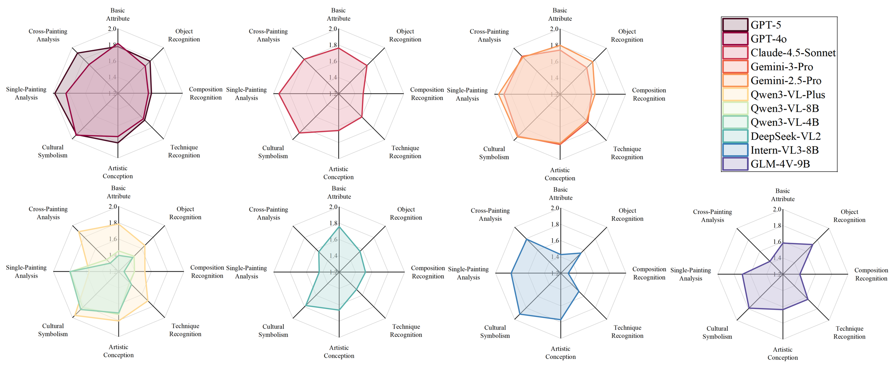
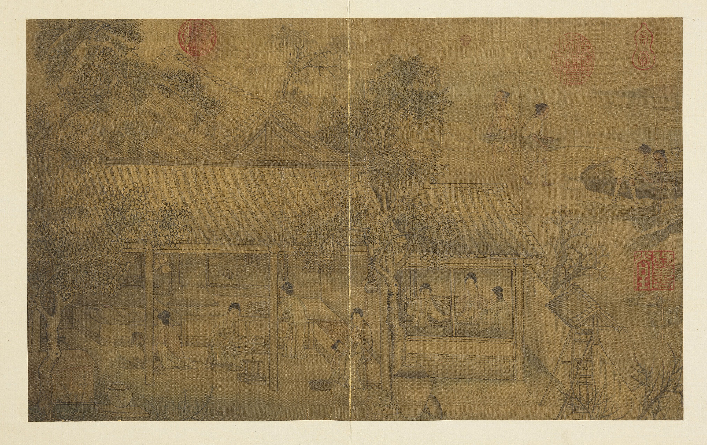
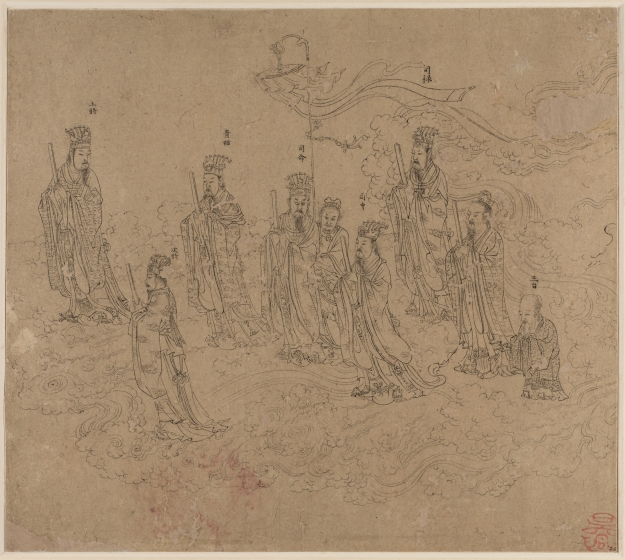
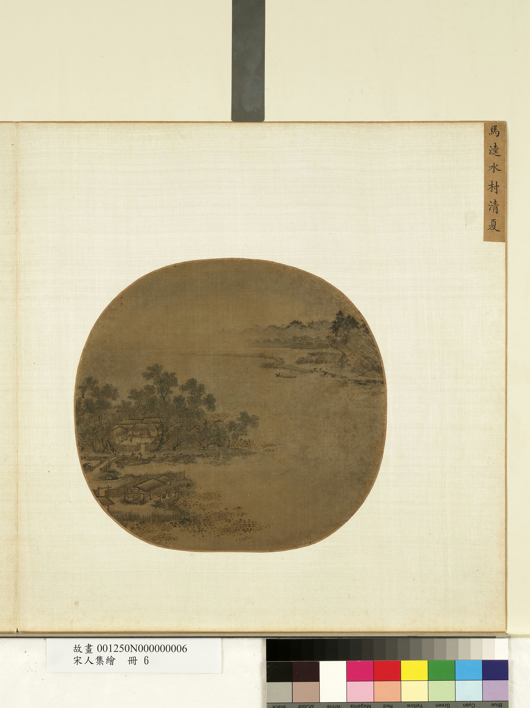

# TCPsBench

**TCPsBench** is a benchmark for evaluating multimodal large language models (MLLMs) on **traditional Chinese painting appreciation**, with a focus on culturally grounded interpretation rather than surface-level visual recognition.

---


## Benchmark Overview

We introduce **TCPsBench**, a benchmark grounded in the classical *Six Principles of Painting*, which provide a systematic framework for evaluating both formal techniques and spiritual expression in traditional Chinese painting.

### Key Statistics

* **Paintings:** 1,679 traditional Chinese paintings
* **Time span:** Wei–Jin period to Qing dynasty (220–1912 AD)
* **Sources:** 6 open-access museum archives
* **Questions:** 10,281 high-quality evaluation questions

### Capability Dimensions

TCPsBench evaluates MLLMs across **three core capability dimensions**:

1. **Basic Recognition**
   Understanding objects, elements, and visual components in paintings.
2. **Semantic Understanding**
   Interpreting artistic concepts, symbolism, and stylistic meaning.
3. **Transfer Reasoning**
   Applying artistic knowledge to novel contexts and reasoning across concepts.

These dimensions are instantiated into **eight evaluation task categories**, covering both low-level perception and high-level artistic interpretation.

### Data Construction

The benchmark is built through a systematic pipeline that includes:

* Data collection from authoritative museum sources
* Expert-guided annotation
* Question generation across multiple formats
* Multi-stage validation to ensure quality and consistency

---

## Evaluation

Using TCPsBench, we evaluate **10 mainstream MLLMs**, including both closed-source and open-source models.

### Key Findings

* Overall performance on traditional Chinese painting appreciation remains limited.
* Models perform particularly poorly on **professional-level tasks**, such as:

  * composition analysis
  * painting technique recognition
* **Closed-source models consistently outperform open-source models** across most tasks.
* Models perform more reliably on **constrained question formats** (e.g., multiple-choice).
* **Open-ended questions** that require integrated visual perception, artistic knowledge, and natural language generation remain highly challenging.


---

## Repository Structure
All QA pairs are stored under the Data/ directory, where each evaluation task corresponds to a single *.jsonl file. The Eval/ directory contains the evaluation code used to assess model performance on TCPsBench.
```text
TCPsBench/
├── Data/
│   ├── T1.jsonl
│   ├── T2.jsonl
│   ├── ...
├── Eval/
│   ├── scripts/
└── README.md
└── Supplementary Material.md
 ```

---
### Figure 1 (Revised Visualization)

To address readability issues caused by overlapping curves in the original radar chart, the visualization has been restructured into seven separate radar plots. Each plot groups models within the same series, allowing clearer intra-series comparison and reducing cross-model visual interference.




## Qualitative error table

## Qualitative Error Analysis of MLLMs in Chinese Art Understanding

### Case 1: *Silk Reeling Scene*


- **Task & Type**: Task 1 - Basic Attribute / Single-Choice 
* **Question**: Which dynasty does this painting belong to? A. Qing Dynasty; B. Song Dynasty; C. Wei-Jin and Northern-Southern Dynasties- D. Tang Dynasty 
- **Ground Truth**: B 
- **Model**: Qwen3-8B 
- **Model Output**: D 
- **Error Type**: Metadata Misclassification, Historical Style Confusion 
- **Analysis**: The model incorrectly predicted the dynasty label, indicating insufficient discrimination of historical stylistic features and weak metadata grounding. 


### Case 2: *Daozi's Ink Treasures: Fifty Frames of Figure Line Drawings*


- **Task & Type**: Task 2 - Object Recognition / Multi-Choice 
* **Question**: Based on the image and annotation data, which character identities appear in the painting? A. Princes and generals, B. Attendants, C. Gods and officials, D. Female officials 
- **Ground Truth**: ABC 
- **Model**: Qwen3-4B 
- **Model Output**: ABCD 
- **Error Type**: Over-selection, unsupported visual inference 
- **Analysis**: The model added an unsupported category, reflecting weak precision control in multi-label recognition. 


### Case 3: *Daoist Retreat in Mountain and Stream*


- **Task & Type**: Task 2 - Object Recognition (Localization) / Yes-No 
- **Question**: Is the object in the coordinate area [875, 595, 982, 708] a "dwelling"? 
- **Ground Truth**: Yes 
- **Model**: DeepSeek-VL2 
- **Model Output**: No 
- **Error Type**: Localization Failure, Spatial Grounding Error 
- **Analysis**: The model failed to correctly identify the dwelling within the specified region, indicating weak spatial grounding. 


### Case 4: *Album of Daoist and Buddhist Themes - Procession of Daoist Deities (Leaf 26)*

.jpg)
- **Task & Type**: Task 3 - Narrative Composition Recognition / Fill 
- **Question**: This painting is of the ______ composition. 
- **Ground Truth**: Narrative Composition 
- **Model**: Gemini-2.5-Pro 
- **Model Output**: Z-shaped Composition 
- **Error Type**: Category Confusion, Geometric Over-Reliance 
- **Analysis**: The model over-relied on local geometric cues and misclassified a narrative structure. 


### Case 5: *Sui Gu Xian Chou Tu*


- **Task & Type**: Task 4 - Technique Recognition / Single-Choice 
* **Question**: Which painting technique is primarily used in this artwork? A. Axe-cut texture strokes; B. Hemp-fiber texture strokes; C. Raveled-rope texture strokes- D. Mi-dot texture strokes 
- **Ground Truth**: A 
- **Model**: Claude-4.5-Sonnet 
- **Model Output**: ABCDA 
- **Error Type**: Instruction Violation, Multi-Answer Output 
- **Analysis**: The model violated the single-choice constraint, demonstrating unstable output control. 


### Case 6: *Water and Lotus under the Tree*


- **Task & Type**: Task 5 - Artistic Conception / Yes-No 
- **Question**: The painting creates an elegant and harmonious palace atmosphere through composition, brushwork, and texture. 
- **Ground Truth**: Yes 
- **Model**: Gemini-2.5-Pro 
- **Model Output**: No 
- **Error Type**: Semantic Misalignment 
- **Analysis**: The model failed to align high-level artistic description with visual evidence. 


### Case 7: *Illustration of an Imperial Poem*


- **Task & Type**: Task 6 - Cultural Symbolism / Single-Choice 
* **Question**: Through imagery and inscription juxtaposition, what traditional cultural meaning does the work primarily convey? A. Sentiment of farewell journey, B. Study of natural vitality, C. Ritual metaphor of deity worship, D. Prayer for harvest and family prosperity
- **Ground Truth**: C 
- **Model**: Gemini-2.5-Pro 
- **Model Output**: D 
- **Error Type**: Cultural Symbol Misinterpretation 
- **Analysis**: The model confused aspirational blessing symbolism with ritual sentiment, indicating weak cultural-semantic grounding. 