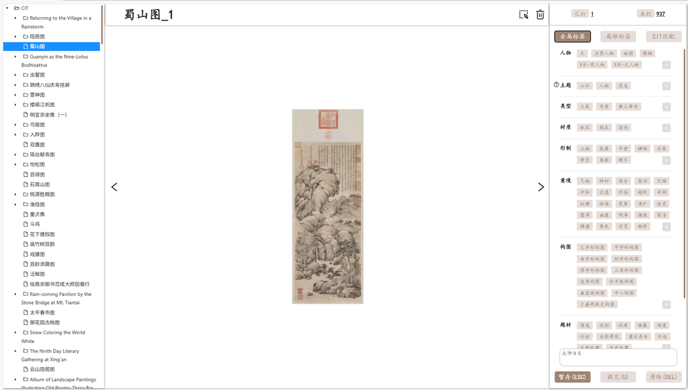
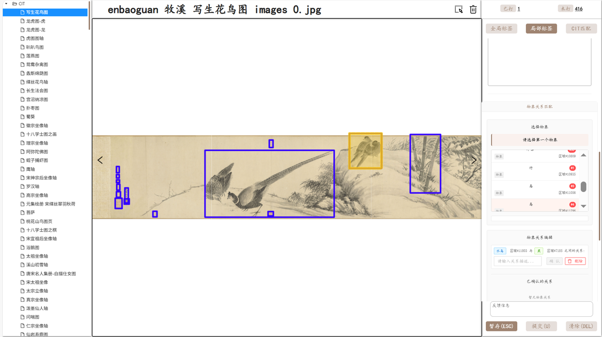

# Supplementary Material

## Annotation Tool
The system provides a comprehensive global labeling framework for traditional Chinese painting. At the whole-image level, annotators assign structured tags covering thematic categories, artistic techniques, compositional types, aesthetic conception, cultural symbolism, material attributes, and related metadata. These global labels capture high-level artistic characteristics and encode compositional principles, stylistic conventions, and culturally embedded meanings, forming the semantic foundation of the dataset.

At the local level, the system supports fine-grained object annotation within each artwork. Annotators identify and categorize specific visual elements—such as figures, birds, plants, rocks, or architectural components—according to a predefined taxonomy. These local labels represent surface-level visual information and provide structured data for object recognition, spatial analysis, and component-level modeling.

The interface enables interactive annotation through direct bounding-box selection on high-resolution scroll or vertical paintings. Annotators can draw boxes to localize objects, assign category labels, and define relationships between selected regions, ensuring precise spatial grounding aligned with the global semantic framework.

Structurally, the interface is organized into three main panels. The left panel presents the artwork directory for dataset navigation, the central panel displays the image and annotation workspace, and the right panel shows the global and local label configuration area. This layout supports efficient navigation, real-time annotation, and structured metadata management within a unified workflow.

## Labeling Guidelines
### Artistic Conception：

Spirit Resonance、Wondrousness、Lofty Antiquity、Aged and Moist、Deep and Majestic、Harmonious and Mild、Plain and Far-Reaching、Simple and Unadorned、Transcendent、Strange and Unconventional、Unrestrained and Expansive、Lush and Vivid、Bleak and Cold、Clear and Open、Liveliness of Nature、Rounded and Whole、Secluded and Profound、Bright and Pure、Vigorous and Forceful、Concise、Meticulous and Precise、Brisk and Refreshing、Ethereal、Graceful and Beautiful

### Bird-and-Flower (Freehand / Xieyi)：

Double-Outline Method、Outline-and-Wash Method、Outline-and-Fill Method、Boneless Method、Ink/Color Breaking Method、Combined Gongbi–Xieyi Method、Splashed Ink / Splashed Color Method

### Bird-and-Flower (Meticulous / Gongbi)：

Baimei (Line Drawing) Method、Meticulous Heavy-Color Method、Meticulous Light-Color Method、Alternating Light-and-Heavy Coloring Method、Boneless Method

### Landscape (Texture Strokes / Cunfa)：

Hemp-Fiber Texture Strokes、Untied-Rope Texture Strokes、Lotus-Leaf Texture Strokes、Ox-Hair Texture Strokes、Axe-Cut Texture Strokes、Raindrop Texture Strokes、“Muddy-with-Water” Texture Strokes、Chopped-Firewood Texture Strokes、Whirling-Vortex Texture Strokes、Rolling-Cloud Texture Strokes、Mi-Dot Texture Strokes、Folded-Belt Texture Strokes

### Figure (Line-Rendering Methods)：

Ancient “Floating-Silk” Lines、Zither-String Lines、Iron-Wire Lines、Mixed-Line Rendering、“Cao Garment” Lines、“Nail-Head and Rat-Tail” Lines、Hoe-Head “Nail” Lines、Leech Lines、Willow-Leaf Lines、Olive Lines、Jujube-Pit Lines、Broken-Reed Lines、Bamboo-Leaf Lines、“Trembling Water-Ripple” Lines、Abbreviated-Stroke Lines、Withered-Firewood Lines、Earthworm Lines、“Flowing-Cloud and Running-Water” Lines、Splashed Ink

### Object Representation：

Object Recognition (CIT-level Mapping)、Object Hierarchy Refinement、Missing-Label Completion

### Bird-and-Flower Composition：

Two-Line Composition、Three-Line Composition、Triangular Composition、Zigzag (S-shaped) Composition、Rule-of-Thirds Composition、Broken-Branch Composition、Full Composition

### Landscape Composition： 

Zigzag (S-shaped) Composition、“Jia”-shaped Composition、“You”-shaped Composition、“Ze”-shaped Composition、“Xu”-shaped Composition、Triangular Composition、Corner Composition、Horizontal-Line Composition、Vertical-Line Composition、Centered Composition、“Three-Tiers, Two-Sections” Composition

### Figure Composition：

Centered Composition、Narrative Composition、Long-Scroll Composition